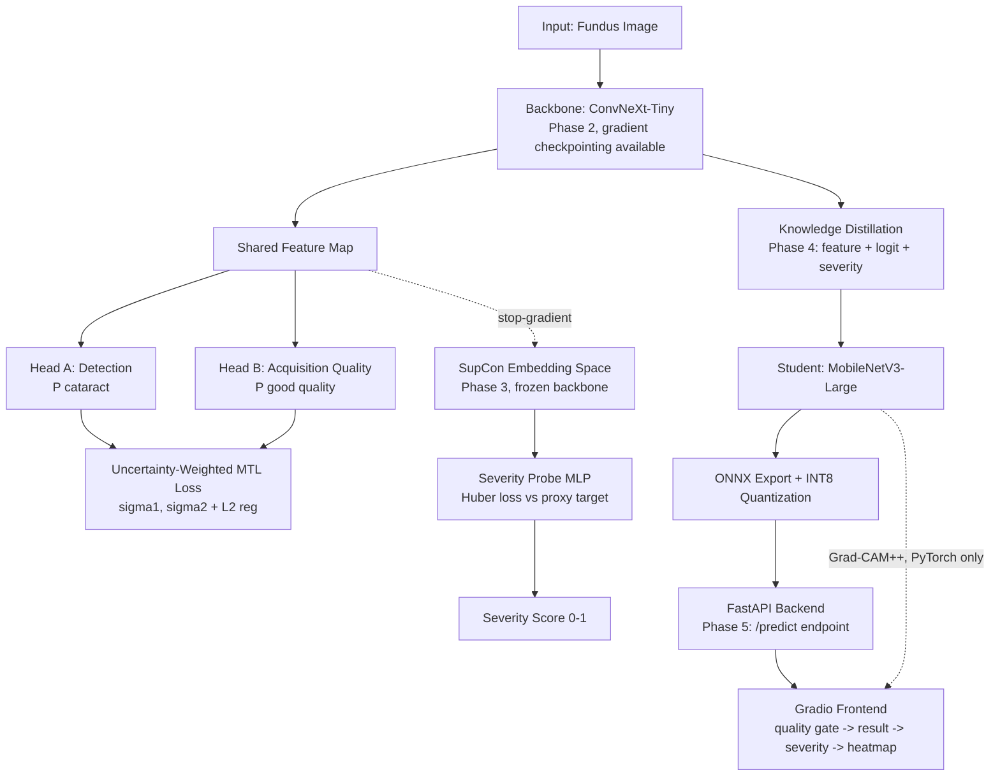

# OmniCataract-X v3.0

**A research-prototype web application for cataract screening from fundus images — binary detection plus a continuous severity proxy, trained entirely on Google Colab Free and deployed as a FastAPI + Gradio app.**

> ⚠️ **This is a research prototype, not a medical device.** It has not been clinically validated. Severity is a statistically-derived proxy from learned embedding geometry, not a LOCS III grade. Do not use this for diagnosis. See [Limitations](#limitations) before using or extending this project.

---

## Table of Contents

1. [What This Project Does](#what-this-project-does)
2. [Project Status](#project-status)
3. [Architecture](#architecture)
4. [Repository Structure](#repository-structure)
5. [Key Design Decisions](#key-design-decisions)
6. [Setup](#setup)
7. [Usage — Phase by Phase](#usage--phase-by-phase)
8. [Running the App](#running-the-app)
9. [Testing Philosophy](#testing-philosophy)
10. [Model Performance](#model-performance)
11. [Limitations](#limitations)
12. [Troubleshooting](#troubleshooting-colab-free)
13. [Roadmap](#roadmap--future-work)
14. [Acknowledgments](#acknowledgments)

---

## What This Project Does

Given an uploaded fundus (retinal) image, OmniCataract-X outputs:

| Output | Description |
|---|---|
| **Cataract: Yes/No** | Binary detection with a confidence score |
| **Image Quality: Good/Poor** | A quality gate that blocks diagnosis on unusable images |
| **Severity: Mild/Moderate/Severe** | A continuous 0–100% proxy score, mapped to a grade |
| **Grad-CAM++ heatmap** | Visual explanation of which region influenced the decision |

### What it explicitly does NOT do

| Not in scope | Why |
|---|---|
| Clinically validated LOCS III severity grading | No dataset with real clinical grades was available — severity is a self-supervised proxy (see [Key Design Decisions](#key-design-decisions)) |
| Cataract sub-type classification (Nuclear/Cortical/PSC) | Requires labels this project's public datasets don't provide |
| Pixel-level lens/opacity segmentation | Requires expert-annotated masks not available at this scope |
| Slit-lamp or multi-modal image input | Fundus-only for this version |
| IOL power calculation / surgical planning | A separate clinical problem requiring biometric data this project doesn't have |
| Regulatory/clinical deployment claims | This is explicitly a research prototype, not a SaMD submission |

---

## Project Status

| Phase | Description | Status |
|---|---|---|
| 1 | Data infrastructure & pipeline | ✅ Implemented & smoke-tested |
| 2 | Core detection model (dual-head MTL) | ✅ Implemented & smoke-tested |
| 3 | Severity engine (SupCon + dual-proxy) | ✅ Implemented & smoke-tested |
| 4 | Optimization, distillation & ONNX export | ✅ Implemented & smoke-tested |
| 5 | Application (FastAPI + Gradio) | ✅ Implemented & smoke-tested |

Every phase ships with a `--smoke-test` mode that exercises the full pipeline end-to-end using synthetic data and untrained models — no GPU, no real dataset, and no prior phase's checkpoint required to verify the code itself is correct. **What has not yet happened is a real training run on real data** — that's the next step for whoever runs this on their own Colab session (see [Usage](#usage--phase-by-phase)).

---

## Architecture



**The single most important structural decision in this codebase:** severity estimation trains on **frozen, detached** backbone features (Phase 3). Gradients from the severity loss can never reach the shared backbone — verified directly in testing by deliberately *not* freezing the backbone externally and confirming the `SeverityProbe`'s internal `.detach()` still blocks every gradient. This means severity — which has no real clinical ground truth — can never silently degrade the detection model, which does have real labels.

---

## Repository Structure

```
omnicataract-x/
├── requirements.txt
├── README.md                                  (this file)
└── src/
    ├── 00_colab_setup.py                       Session bootstrap: seeds, GPU check, Drive mount
    ├── 01_data_infrastructure.py                Kaggle download, patient-ID split, DataLoaders
    ├── 02_core_detection_model.py               ConvNeXt-Tiny dual-head model + MTL training loop
    ├── 03_severity_engine.py                    SupCon + dual-proxy severity + Severity Probe
    ├── 04_optimization_distillation_export.py   Distillation, ONNX export, INT8 quantization
    └── 05_application.py                        FastAPI backend + Gradio frontend + Grad-CAM++
```

Files are numbered to indicate execution order. They're intentionally **not** packaged as a proper Python package (no `__init__.py`, no `pip install -e .`) — each file loads the previous phase's module directly by path (see `load_module()` / `load_phase2_module()` in each file) specifically so a numbered filename stays valid and a beginner can see pipeline order at a glance in a file browser, which matters more for a solo Colab-based project than standard packaging conventions would.

---

## Key Design Decisions

These are the decisions most likely to need explaining to someone reading this code for the first time — each was made deliberately, for a specific reason, not by default.

### Why severity is a "proxy," not a clinical grade
No public dataset used here has real LOCS III severity annotations. Rather than faking a 3-class classifier trained on invented labels, severity is derived from **two independently-computed signals**, cross-validated against each other:
- **Proxy A:** L2 distance from the "Normal" class centroid in a SupCon-trained embedding space
- **Proxy B:** the raw pathology-head logit magnitude from the (separately, supervised-label-trained) detection model

Their Spearman correlation is computed and reported honestly — including if it's weak — rather than silently picking whichever proxy looks better. Mild/Moderate/Severe are **statistical tertile cutoffs** on the resulting score among cataract-positive cases, not clinical boundaries.

### Why the backbone is frozen before severity training
See the architecture note above. This is enforced at two levels: `freeze_backbone()` sets `requires_grad=False` externally, and `SeverityProbe.forward()` calls `.detach()` internally as a second, independent safeguard — tested directly to confirm it holds even if the external freeze step is skipped.

### Why quality-label sourcing is left as an open decision (flagged in code)
The public datasets used (ODIR-5K, RFMiD) have no ground-truth "image quality" label. `02_core_detection_model.py`'s training loop uses a placeholder (`qual_labels = all ones`) so the pipeline and loss math could be verified independently of that decision — see the `NOTE_ON_QUALITY_LABELS` comment in that file. **Before a real training run**, you need to choose either a no-reference IQA proxy (e.g. BRISQUE, thresholded) or a self-supervised approach, and wire it into `train_one_epoch()` / `validate_one_epoch()`.

### Why distillation uses feature-map matching, not just logit matching
Plain logit distillation transfers *what* the teacher predicts but not *how* it represents the image internally. Feature-map matching (with 1×1 conv adapters bridging ConvNeXt-Tiny's and MobileNetV3's different channel counts at each of 4 matched stages) better preserves the teacher's spatial reasoning in the much smaller student — verified by testing that the hook points used correspond to real, spatially-matched layers in both architectures (`get_teacher_hook_modules()` / `get_student_hook_modules()` in `04_optimization_distillation_export.py`).

### Why the quality gate is enforced in the frontend, not just the backend
The backend always computes and returns `quality_status`. It's the **Gradio frontend's** `format_result_for_display()` that decides not to show a diagnosis when quality is poor — verified directly by testing that a response with `cataract_detected=True` but `quality_status="poor"` still displays *only* the retake warning. A user should never receive a false-confidence result on an image too poor to trust.

### Why every phase has a `--smoke-test` mode
Each phase file can be run standalone with `--smoke-test` using synthetic data and untrained (`pretrained=False`) models — no GPU, no dataset, no prior checkpoint required. This is how every phase in this repository was actually built and debugged: syntax-check → smoke-test → find and fix real bugs the smoke test surfaces → targeted correctness tests for the trickiest logic → package. See [Testing Philosophy](#testing-philosophy).

---

## Setup

### Requirements
- Google Colab Free account (NVIDIA T4 GPU, ~16GB VRAM, ~12GB RAM — not guaranteed every session)
- A Kaggle account + API token (for dataset download)
- Local machine with VS Code, used only for code editing and version control — **no local training required or expected**

### Installation

```bash
pip install -r requirements.txt --break-system-packages
```

On Colab, most of `requirements.txt` is already preinstalled — only install what's missing for your session (check with `pip show <package>` before reinstalling everything, to avoid dependency resolver churn).

### Google Drive folder structure

Run `00_colab_setup.py` first, every session — it creates and verifies:

```
/content/drive/MyDrive/OmniCataract-X/
├── datasets/       (dataset .zip archive — never store raw unzipped datasets here)
├── checkpoints/    (rolling checkpoints per phase, last 2-3 + best-so-far)
├── logs/           (run configs, splits, W&B-independent logs)
├── results/        (metrics CSVs, plots, severity proxy tables)
└── exports/        (ONNX models, FP32 and INT8)
```

### Kaggle API

1. Go to [kaggle.com/settings](https://www.kaggle.com/settings) → API → Create New Token
2. Upload the downloaded `kaggle.json` to your Colab session
3. Run `01_data_infrastructure.py --download --kaggle-json /content/kaggle.json` (one-time)

**Before running this for real:** the Kaggle dataset slugs in `01_data_infrastructure.py` (`download_datasets()`) are placeholders — verify the actual current slugs on kaggle.com, since they occasionally change and a wrong slug fails loudly rather than silently.

---

## Usage — Phase by Phase

Every phase can be smoke-tested with no dataset or GPU:

```bash
cd src/
python 01_data_infrastructure.py --verify        # after --download and --archive, one-time
python 02_core_detection_model.py --smoke-test
python 03_severity_engine.py --smoke-test
python 04_optimization_distillation_export.py --smoke-test
python 05_application.py --smoke-test
```

### Phase 1 — Data Infrastructure
```bash
python 01_data_infrastructure.py --download --kaggle-json /content/kaggle.json   # one-time
python 01_data_infrastructure.py --archive                                       # one-time, zips to Drive
python 01_data_infrastructure.py --unzip                                         # every session
python 01_data_infrastructure.py --verify                                        # full Phase 1 exit-milestone check
```
**Exit milestone:** patient-ID split passes its leakage-check assertion; one dummy epoch runs at >100 images/sec.

### Phase 2 — Core Detection Model
Intended to be driven from a notebook cell with real DataLoaders from Phase 1:
```python
phase2 = import_module("02_core_detection_model")
model = phase2.CataractDetectorDualHead()
loss_fn = phase2.HomoscedasticMTLLoss()
result = phase2.run_training(model, loss_fn, train_loader, val_loader, device="cuda")
```
**Exit milestone:** validation AUC reported with a bootstrapped 95% CI (no hardcoded target — report whatever the real number is); σ/gradient-norm logs confirm neither task was silently abandoned.

### Phase 3 — Severity Engine
Requires a trained Phase 2 checkpoint:
```python
phase3 = import_module("03_severity_engine")
phase3.freeze_backbone(model)
projection_head = phase3.SupConProjectionHead(input_dim=model.feature_dim)
phase3.train_supcon(model, projection_head, train_loader, device="cuda")
```
**Exit milestone:** SupCon embedding space visibly separates classes; both severity proxies cross-correlated (Spearman ρ reported honestly); face-validity grid generated for manual review.

### Phase 4 — Optimization & Export
Requires trained Phase 2 + Phase 3 checkpoints:
```python
phase4 = import_module("04_optimization_distillation_export")
student = phase4.build_student_model(phase2_module)
phase4.train_distillation(teacher, teacher_severity_probe, student, student_severity_probe, train_loader, device="cuda")
combined = phase4.CombinedExportModel(student, student_severity_probe)
onnx_path = phase4.export_to_onnx(combined, "model.onnx")
phase4.quantize_to_int8(onnx_path, "model_int8.onnx", calibration_images)
```
**Exit milestone:** working `.onnx` file; latency and model size **measured**, not assumed (in testing, INT8 was *slower* than FP32 on the CPU used — benchmark both on your actual target hardware, don't assume INT8 wins).

### Phase 5 — Application
```bash
python 05_application.py --backend --onnx-path <path> --thresholds-path <path>   # standalone server
```
Or, from within the same Colab session (backend in a background thread, frontend in the main thread):
```python
app5 = import_module("05_application")
app5.run_backend_in_thread(onnx_path="...", thresholds_path="...")
app5.launch_frontend(student_model=my_loaded_pytorch_student, share=True)
```

---

## Running the App

1. Complete Phases 1–4 to produce a trained, exported `.onnx` model and a `severity_summary.json`.
2. Start the backend (see above).
3. Launch the Gradio frontend, passing the PyTorch **student** model (not the ONNX one — Grad-CAM++ needs real gradients).
4. Upload a fundus image. The flow is:

```
upload → quality check → [if poor: retake warning, STOP]
                       → [if good: detection result → severity gauge → Grad-CAM++ heatmap → disclaimer]
```

---

## Testing Philosophy

This codebase was built with a consistent discipline across all five phases:

1. **Syntax check** (`py_compile`) — catches nothing interesting, but it's free.
2. **Smoke test** — full pipeline, synthetic data, untrained models. This is where most real bugs actually surfaced:
   - Phase 1: a deprecated Albumentations parameter, a `persistent_workers` crash at `num_workers=0`
   - Phase 2: `grad_norm` silently reading `0.0` every epoch (gradients were cleared before being measured), a deprecated `GradScaler` API call
   - Phase 4: an offline-testability gap in `build_student_model`, an ONNX exporter dependency issue on newer torch versions
   - Phase 5: a design gap where safety-critical logic was trapped in an untestable Gradio closure
3. **Targeted correctness tests** for the logic a smoke test can't verify by just "not crashing":
   - SupCon loss verified to actually pull same-class embeddings together and push different-class ones apart (via direct gradient-descent optimization test)
   - The stop-gradient boundary verified to hold even when the external freeze step is deliberately skipped
   - Checkpoint save/resume verified to correctly restore the *learned* uncertainty-weighting σ parameters into a fresh model instance
   - ONNX/PyTorch numerical equivalence verified with both a positive case (max diff ~6×10⁻⁸) and a negative control (comparing genuinely different models, confirming the checker actually detects divergence)
   - The app's safety gate verified with an adversarial case: a backend response with `cataract_detected=True` AND `quality_status="poor"`, confirming the frontend still shows only the retake warning

**Every bug fix above came from actually running the code, not from re-reading it.** If you extend this project, keep the smoke-test pattern — it's cheap insurance against exactly the class of bug that a code review alone won't catch.

---

## Model Performance

*(To be filled in after a real training run on real data — every phase's evaluation functions produce these numbers with bootstrapped 95% confidence intervals; no target numbers are hardcoded or promised in advance anywhere in this codebase.)*

| Metric | Value | 95% CI |
|---|---|---|
| Detection AUC (internal test) | — | — |
| Detection AUC (RFMiD pseudo-external) | — | — |
| ΔAUC (domain shift) | — | — |
| Severity proxy cross-correlation (Spearman ρ) | — | — |
| Expected Calibration Error (ECE) | — | — |
| Student vs. Teacher detection-prob correlation | — | — |
| Student vs. Teacher, borderline cases only | — | — |
| FP32 ONNX latency (median, CPU) | — | — |
| INT8 ONNX latency (median, CPU) | — | — |
| Model size (FP32 → INT8) | — | — |

---

## Limitations

- **Severity is a statistically-derived proxy from learned embedding geometry, not a clinically validated LOCS III grade.**
- **Binary detection is trained on public data with known label-quality and comorbidity caveats** (ODIR-5K).
- **Domain-shift testing uses a single pseudo-external dataset** (RFMiD), not a prospective multi-site clinical trial.
- **No IOL power calculation, no multi-modal (slit-lamp) input, no pixel-level segmentation.**
- **Acquisition-quality labels are not ground-truth** — sourced via a weak-supervision proxy (see [Key Design Decisions](#key-design-decisions)); this must be finalized before a real training run.
- **SupCon operates at reduced effective batch size** on single-GPU, free-tier compute, which may understate its full potential contribution.
- **This is a research prototype and must not be used as a substitute for professional ophthalmological diagnosis.**

---

## Troubleshooting (Colab Free)

| Problem | Fix |
|---|---|
| GPU sits at low utilization | Never read training images directly from Drive — train from local `/content/` disk only (see `session_start_unzip()`) |
| Session dies mid-epoch | Every phase checkpoints per-epoch to Drive; resume with the appropriate `--resume` / checkpoint-loading path |
| RAM crash despite fine GPU VRAM | Keep `num_workers=2` max; never pre-load full datasets into Python lists (the `CataractDataset` class is lazy-loading by design) |
| Drive fills up | Rolling checkpoint cleanup keeps only the last 2-3 + best — verify `cleanup_old_checkpoints()` is actually being called |
| SupCon underperforms | Expected at small batch sizes — documented as a known, mitigated limitation, not a bug |
| INT8 model is slower than FP32 | Real, hardware-dependent behavior seen in testing — always benchmark both, don't assume INT8 wins |
| No GPU assigned this session | Colab Free doesn't guarantee GPU availability — treat this as a planning risk, not a bug in your code |

---

## Roadmap / Future Work

Explicitly out of scope for this version, listed here rather than silently omitted:

- Multi-modal fusion (fundus + slit-lamp) via cross-attention gating
- A genuine IOL power regressor (requires post-operative outcome data and its own regulatory track)
- Real multi-rater clinical severity grading (requires an ophthalmology partnership)
- Prospective, multi-site external validation
- On-device (mobile, no-backend) deployment

---

## Acknowledgments

Built iteratively across five phases, each independently designed, implemented, and tested before the next began. Architecture decisions were shaped by a series of critical-review passes specifically aimed at removing overclaiming and unverified assumptions — see the [Key Design Decisions](#key-design-decisions) section for what changed and why at each stage.